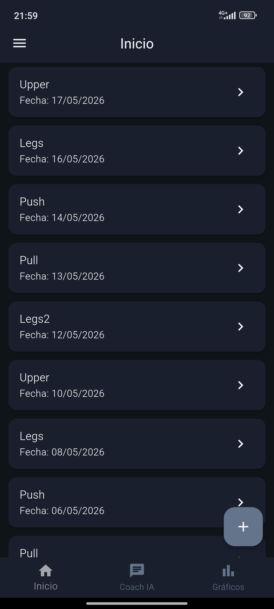
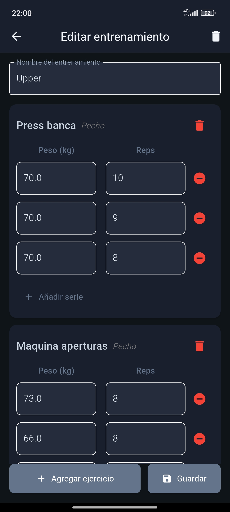
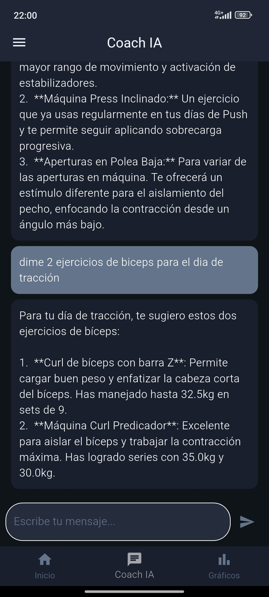
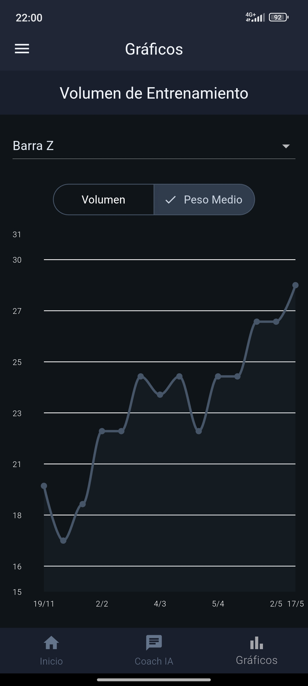

# 💪 Stronger — Fitness & AI Coach App


**Stronger** es una aplicación móvil desarrollada en **Flutter** que combina el seguimiento de entrenamientos, análisis de progreso y asistencia inteligente mediante IA.
El objetivo es ofrecer una experiencia personalizada para cada usuario, permitiéndole registrar, analizar y mejorar su rendimiento físico día a día.

---

## 📸 Capturas de pantalla

<!-- Reemplaza estas líneas con tus imágenes reales -->
| Inicio | Entrenamiento | Chat IA | Progreso |
|--------|--------------|---------|---------|
|  |  |  |  |

---

## 🚀 Características principales

- 🔐 **Autenticación segura con Firebase Auth** — registro e inicio de sesión por email.
- 🏋️‍♂️ **Gestión de entrenamientos personalizados** — crea sesiones con ejercicios y series, guarda borradores automáticamente.
- 📊 **Historial de entrenamientos** — visualiza y edita todas tus sesiones anteriores.
- 📈 **Análisis de progreso** — gráficos de volumen y peso medio por ejercicio a lo largo del tiempo.
- 📏 **Medidas corporales** — registra y visualiza tu evolución de peso, grasa y músculo.
- 🤖 **Asistente con IA (Gemini)** — chat que analiza tu historial real de entrenamientos y responde preguntas personalizadas.
- ☁️ **Sincronización en la nube** con Firebase Firestore.
- 🎨 **Tema claro y oscuro**, con navegación declarativa mediante GoRouter.

---

## 🛠️ Tecnologías utilizadas

| Categoría | Tecnología |
|-----------|-----------|
| **Framework** | Flutter (Dart 3) |
| **Autenticación** | Firebase Auth |
| **Base de datos** | Firebase Firestore |
| **IA** | Google Gemini 2.5 Flash |
| **Estado** | Provider + ChangeNotifier |
| **Navegación** | GoRouter |
| **Gráficos** | fl_chart |
| **Persistencia local** | SharedPreferences |

---

## ⚙️ Instalación

### Requisitos previos

- [Flutter SDK](https://docs.flutter.dev/get-started/install) 3.x
- Proyecto en [Firebase Console](https://console.firebase.google.com) con Auth y Firestore habilitados
- API Key de [Google AI Studio](https://aistudio.google.com) (Gemini)

### Pasos

```bash
# 1. Clona el repositorio
git clone https://github.com/tu-usuario/stronger.git
cd stronger

# 2. Instala las dependencias
flutter pub get

# 3. Configura las variables de entorno
cp variables.env.example variables.env
# Edita variables.env y añade tu GEMINI_API_KEY

# 4. Añade tu google-services.json de Firebase
# android/app/google-services.json

# 5. Ejecuta la app
flutter run
```

### Variables de entorno

Crea un archivo `variables.env` en la raíz del proyecto:

```env
GEMINI_API_KEY=tu_api_key_aqui
```

---

## 📁 Estructura del proyecto

```
lib/
├── models/              # Modelos de datos
├── infrastructure/
│   └── services/        # Firebase, Gemini, gráficos
├── UI/
│   ├── pages/           # Pantallas
│   └── widgets/         # Componentes reutilizables
├── theme/               # Temas claro y oscuro
└── router.dart          # Configuración de rutas
```

---

## 📄 Licencia

Este proyecto está bajo la licencia MIT. Consulta el archivo [LICENSE](LICENSE) para más detalles.
