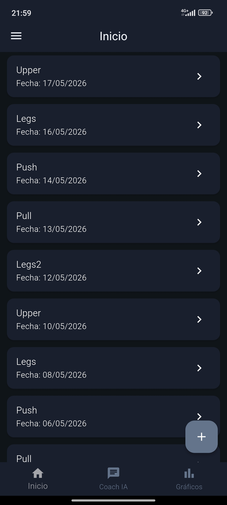
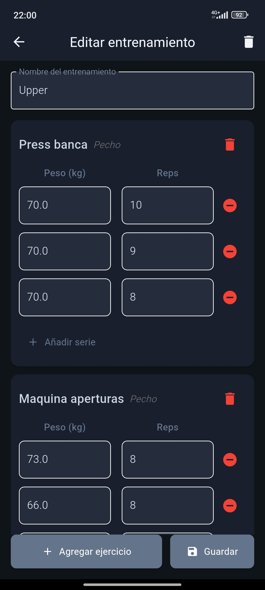
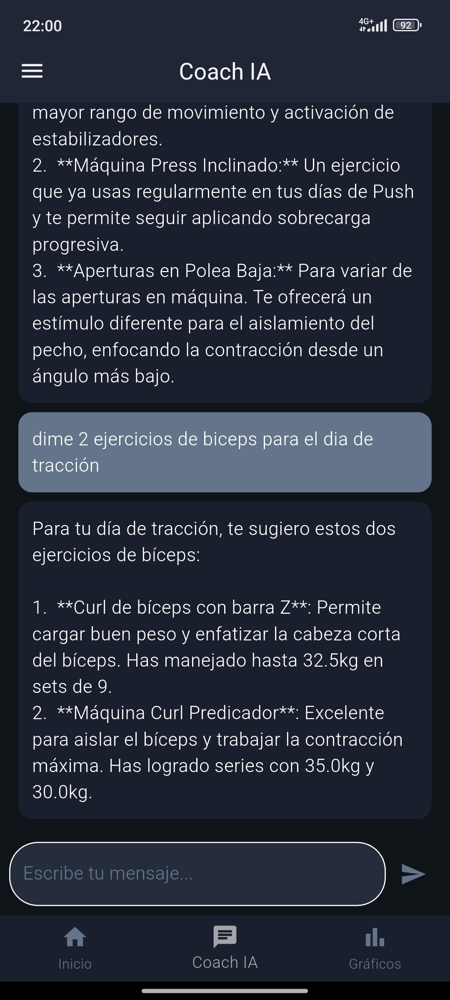
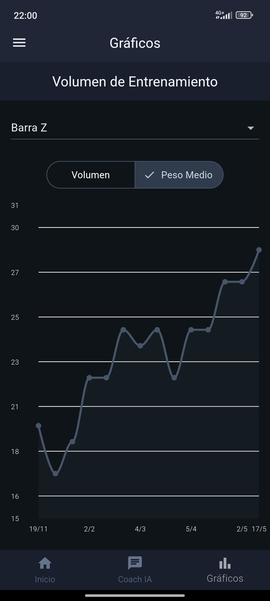

# 💪 Stronger — Fitness & AI Coach


Stronger es una aplicación Flutter para registrar entrenamientos, consultar la
evolución física y recibir orientación personalizada mediante Gemini. Está
planteada como un proyecto de portfolio: arquitectura clara, datos aislados por
usuario, tests automatizados y una integración de IA segura para aplicaciones
móviles.

## Capturas

| Inicio | Entrenamiento | Chat IA | Progreso |
|---|---|---|---|
|  |  |  |  |

## Funcionalidades

- Autenticación por email mediante Firebase Auth.
- Creación, edición e historial de entrenamientos con borradores locales.
- Sugerencias de series basadas en el entrenamiento anterior.
- Gráficos de volumen, peso medio y composición corporal.
- Mapa corporal con estimación y recuperación progresiva de fatiga muscular.
- Coach contextual que analiza los entrenamientos y medidas del usuario.
- Tema claro y oscuro y navegación declarativa con GoRouter.

## Arquitectura de IA

```text
Flutter ── App Check + Firebase Auth ──> Firebase AI Logic ──> Gemini
   │
   └── Firestore: datos del usuario autenticado
```

La aplicación utiliza el SDK oficial `firebase_ai`. Las peticiones pasan por el
proxy de Firebase AI Logic, por lo que la credencial de Gemini no se incluye en
el código, APK o build web. La configuración elegida funciona con el plan Spark
y la cuota gratuita de Gemini Developer API.

Consulta [la guía de configuración de IA](docs/ai.md) para activar el servicio,
App Check y el modo de usuarios autenticados.

## Tecnologías

| Área | Tecnología |
|---|---|
| Aplicación | Flutter y Dart 3 |
| Autenticación | Firebase Auth |
| Base de datos | Cloud Firestore |
| IA | Firebase AI Logic + Gemini 3.5 Flash |
| Protección | Firebase App Check |
| Estado | Provider + ChangeNotifier |
| Navegación | GoRouter |
| Gráficos | fl_chart |
| Persistencia local | SharedPreferences |

## Puesta en marcha

Requisitos: Flutter 3.44 o posterior y un proyecto Firebase con Authentication y
Firestore habilitados.

```bash
git clone https://github.com/marwix127/Stronger.git
cd Stronger
flutter pub get
flutter run
```

No se necesita `variables.env`, una API key de Gemini ni Firebase Cloud
Functions. Los archivos de configuración generados por FlutterFire contienen
identificadores públicos de Firebase, no secretos de Gemini.

Para web hay que proporcionar la clave pública del proveedor de App Check:

```bash
flutter run -d chrome --dart-define=RECAPTCHA_SITE_KEY=public_site_key
```

## Calidad

```bash
flutter analyze
flutter test
flutter build web --release --dart-define=RECAPTCHA_SITE_KEY=public_site_key
```

La suite cubre modelos, servicios de Firestore, formateo seguro del contexto,
validación de respuestas estructuradas y recuperación de fatiga.

## Estructura principal

```text
lib/
├── models/                        # Entidades de dominio
├── infrastructure/services/
│   ├── firebase/                  # Auth y persistencia
│   ├── coach_service.dart         # Coach mediante Firebase AI Logic
│   └── muscle_fatigue_service.dart
├── UI/pages/                      # Pantallas
├── UI/widgets/                    # Componentes reutilizables
├── theme/                         # Temas claro y oscuro
└── router.dart                    # Rutas y protección de navegación
test/                              # Tests unitarios y de servicios
docs/                              # Configuración y material de portfolio
```

## Licencia

Distribuido bajo la licencia MIT. Consulta [LICENSE](LICENSE).
